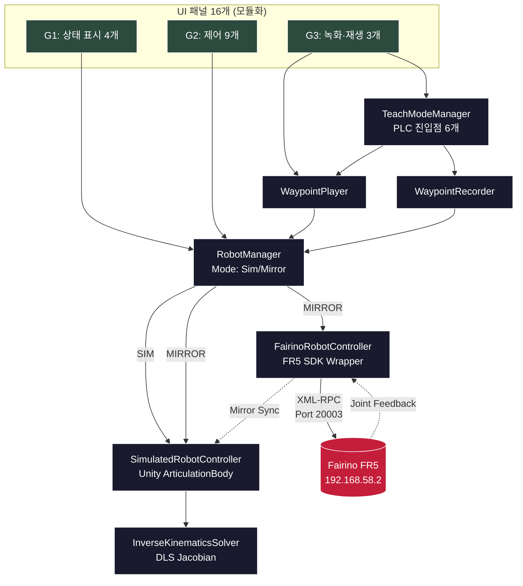

# 🤖 Fairino FR5 Digital Twin v2

> Unity 시뮬레이터와 산업용 협동로봇 Fairino FR5를 실시간 동기화하는 디지털 트윈 시스템 — 모듈화 재설계 버전

[](https://unity.com/)
[](https://docs.microsoft.com/en-us/dotnet/csharp/)
[](LICENSE)
[]()

<!-- 시각 자료 추가 예정: docs/images/demo.gif -->

---

## 📋 Overview

**Fairino FR5 Digital Twin v2**는 산업용 6-DOF 협동로봇과 Unity 3D 시뮬레이터를 통합한 디지털 트윈 시스템의 재설계 버전입니다. 모듈화된 16개 UI 패널과 PLC 시뮬레이션, Waypoint 녹화·재생 기능을 통해 디지털 트윈의 시연 가치와 유지보수성을 동시에 확보했습니다.

### v1과의 관계

[v1 (fairino-fr5-digital-twin)](https://github.com/kimar1022-code/fairino-fr5-digital-twin)은 단일 `RobotControlUI`에 모든 UI를 자동 생성하는 모놀리식 구조였습니다. 초기 검증에는 적합했으나 다음 한계로 v2 재설계를 결정했습니다:

- 단일 거대 클래스의 유지보수 부담
- AI 페어 프로그래밍 시 시그니처 추측에 의한 컴파일 에러 누적

v2는 이러한 한계를 **모듈화된 패널 아키텍처**와 **사전 검증 우선 워크플로우**로 해결합니다.

| 항목 | 사양 |
|---|---|
| 로봇 모델 | Fairino FR5 (6-DOF 협동로봇) |
| Unity 버전 | 6000.4.3f1 |
| 언어 | C# (.NET Framework) |
| SDK | Fairino C# SDK (XML-RPC) |
| 통신 | Ethernet (192.168.58.2) |
| 개발 기간 | 2026– |

---

## ✨ Features

### 🎮 모드 시스템 (단순화)
- **SIM 모드**: 시뮬레이션 단독 동작 (실로봇 없이 테스트)
- **MIRROR 모드**: 시뮬+실로봇 동시 동기화 (Sim이 Real을 매 프레임 추종)
- v1의 REAL 단독 모드는 안전성 우선 정책에 따라 제거

### 🦾 모듈화된 16개 UI 패널
v1의 단일 `RobotControlUI` → 책임별로 분리된 독립 패널로 재구성:

- **상태 표시 (G1)**: StatusPanel · ConnectionPanel · ModePanel · SpeedPanel
- **제어 (G2)**: HomePanel · StopPanel · GripperPanel · CartesianControlPanel · ControlModePanel · CartesianJogPanel · JointControlPanel + 보조 컴포넌트 2개
- **녹화·재생 (G3)**: WaypointItem · WaypointPanel · TeachPanel

### 🎙️ Waypoint 녹화 & PLC 시뮬레이션 (신규)
- **WaypointRecorder**: 현재 자세(조인트 6 + TCP 6 + 그리퍼)를 메모리 리스트로 누적 저장
- **WaypointPlayer**: Play / Pause / Resume / Stop 4단계 재생 제어 + 4개 이벤트 발행
- **TeachPanel**: 실로봇 PLC 6 물리버튼(Go Home / Record Start·Stop / Save Waypoint / Play / Stop)을 UI로 재현 — 디지털 트윈의 *"실환경 재현"* 본질에 충실

### 🤏 그리퍼 & 홈 포즈 관리
- 0~100% 개폐 + 속도/힘 조절 (Fairino DH 그리퍼)
- 홈 포즈 저장/복귀 (v1의 3개 Pose Slot은 단순화 정책으로 제거)

---

## 🏗️ Architecture



**핵심 설계 원칙**:
1. **Sim은 Real의 그림자** (v1에서 검증된 패턴 계승): Mirror 모드에서 Sim의 자체 IK를 사용하지 않고 Real의 결과를 매 프레임 재생
2. **단일 책임 패널**: 각 UI 패널은 하나의 RobotManager 책임 영역만 담당. 패널 간 의존성 0
3. **이벤트 기반 갱신 우선**: 가능한 곳은 이벤트 구독, 불가피한 곳만 Update 폴링 (예: WaypointRecorder는 이벤트 0개라 Count 폴링)

---

## 🛠️ Tech Stack

- **Engine**: Unity 6000.4.3f1 (URP)
- **Language**: C# (.NET Framework)
- **Robotics**: Unity URDF Importer, ArticulationBody
- **IK**: Damped Least Squares (DLS) Jacobian (직접 구현, v1 계승)
- **Communication**: XML-RPC (CookComputing.XmlRpcV2)
- **Robot SDK**: Fairino C# SDK (libfairino.dll)
- **Development Workflow**: AI 페어 프로그래밍 (Anthropic Claude Code) + 사전 검증 사이클

---

## 📁 Project Structure

```
fairino-fr5-digital-twin-v2/
├── Assets/
│   └── Scripts/
│       └── RobotControl/
│           ├── Core/                          # Phase 1 코어
│           │   ├── IRobotController.cs
│           │   ├── RobotManager.cs
│           │   ├── SimulatedRobotController.cs
│           │   ├── FairinoRobotController.cs
│           │   ├── InverseKinematicsSolver.cs
│           │   ├── CoordinateConverter.cs
│           │   ├── GripperController.cs
│           │   └── ... (총 11개 코어 클래스)
│           ├── PLC/                           # PLC 입력 + Waypoint 데이터
│           │   ├── PLCButtonHandler.cs
│           │   ├── Waypoint.cs
│           │   └── WaypointRecorder.cs
│           ├── Teach/                         # 녹화·재생 매니저
│           │   ├── TeachModeManager.cs
│           │   ├── WaypointPlayer.cs
│           │   └── WaypointStorage.cs
│           └── UI/
│               └── Panels/                    # 16개 신규 모듈 패널
│                   ├── StatusPanel.cs
│                   ├── ConnectionPanel.cs
│                   ├── ModePanel.cs
│                   ├── SpeedPanel.cs
│                   ├── HomePanel.cs
│                   ├── StopPanel.cs
│                   ├── GripperPanel.cs
│                   ├── CartesianControlPanel.cs
│                   ├── ControlModePanel.cs
│                   ├── JogButton.cs
│                   ├── CartesianJogPanel.cs
│                   ├── JointControlRow.cs
│                   ├── JointControlPanel.cs
│                   ├── WaypointItem.cs
│                   ├── WaypointPanel.cs
│                   └── TeachPanel.cs
├── docs/
│   ├── DEVELOPMENT_LOG.md
│   └── SETUP.md
├── README.md
├── LICENSE
└── .gitignore
```

---

## 🚀 Getting Started

### Prerequisites
- Unity 6000.4.3f1
- URDF Importer 패키지
- Fairino FR5 + 펌웨어 (티치펜던트 Auto 모드)

### Installation

```bash
git clone https://github.com/kimar1022-code/fairino-fr5-digital-twin-v2.git
```

자세한 설치 가이드는 [`docs/SETUP.md`](docs/SETUP.md)를 참고하세요.

### Network Configuration
| 항목 | 값 |
|---|---|
| Robot IP | `192.168.58.2` |
| PC IP | `192.168.58.100` |
| Subnet | `255.255.255.0` |

---

## 🔑 가장 큰 발견: 추측 금지 + 사전 검증 우선

v1 개발 중 가장 잦았던 컴파일 에러는 **AI가 멤버 시그니처를 추측해서 호출**하는 패턴이었습니다.

```csharp
// v1 패턴 (문제 발생)
panel.SetSomething(robot.GetActualTCPPose());
// 실제 클래스에는 GetActualTCPPose가 없고 GetCurrentTCPPose만 존재 → 컴파일 에러
```

v2에서는 모든 멤버 호출 전 **Read 도구로 시그니처 직접 검증**을 의무화했습니다:

```
워크플로우:
1. 사전 검증 — 호출할 클래스의 .cs 파일을 Read로 직접 확인
2. 사양 결정 — 사용자 결정 사안을 명시적으로 분리 (예: 10대 결정)
3. 명령 — 검증된 시그니처만 사용한 코드 작성
4. 미리보기 검증 — PowerShell 시각적 잘림 vs 실제 결함 분기
5. 1(Yes) / 거부 / Read 진단 — 결과에 따라 분기
```

이 사이클을 16개 패널 모두에 적용하여 **Phase 2 코드 100% 컴파일 통과** (에러 0개, 경고 0개)를 달성했습니다.

---

## 🐛 Troubleshooting

v1 개발 중 해결한 주요 이슈와 v2에서 새로 발견한 이슈입니다.

| 이슈 | 원인 | 해결 |
|---|---|---|
| **rc=14 joint command error** *(v1)* | Tool/Wobj 불일치 | Connect 시 자동 감지 |
| **MoveJ DescPose Zero 에러** *(v1)* | DescPose=(0,...) 시 IK 실패 | DescPose 인자 없는 오버로드 사용 |
| **조인트 간 간섭** *(v1, Critical)* | targetJointAngles 미동기화 | 변경 안 하는 관절을 현재 실측값으로 동기화 |
| **Cartesian JOG Sim/Real 불일치** *(v1)* | URDF DLS IK ≠ SDK IK | Mirror 모드에서 Sim IK 비활성화 |
| **PowerShell 명령 잘림** *(v2)* | 4500자 이상 명령은 콘솔에서 손실 | 파일 저장 → Read로 우회 패턴 |
| **PowerShell 시각적 잘림** *(v2)* | 미리보기 표시 단계의 잔상 | Read 도구로 디스크 직접 확인 |

자세한 디버깅 과정은 [`docs/DEVELOPMENT_LOG.md`](docs/DEVELOPMENT_LOG.md)에서 확인할 수 있습니다.

---

## 🛣️ Roadmap

- [x] **Phase 1**: 코어 시스템 + URDF 임포트 + Sim/Real 인터페이스 통합 (v1 계승)
- [x] **Phase 2**: 16개 UI 패널 + TeachModeManager 확장 (코드 100% 완성)
- [ ] **Phase 3**: 씬 구성 — Unity Editor에서 GameObject 배치 + Inspector 연결
- [ ] **Phase 4**: 실로봇 연결 테스트 + Mirror 모드 검증
- [ ] **Phase 5**: WaypointStorage 영구 저장 (JSON) 통합
- [ ] **Phase 6**: 시연 영상 + 포트폴리오 자료 제작

---

## 📚 References

- [Unity URDF Importer](https://github.com/Unity-Technologies/URDF-Importer)
- [Fairino Official](https://www.fairino.com)
- Buss & Kim, *"Selectively Damped Least Squares for Inverse Kinematics"* (2005)
- [v1 Repository (이전 버전)](https://github.com/kimar1022-code/fairino-fr5-digital-twin)

---

## 📜 License

본 프로젝트의 코드는 [MIT License](LICENSE)를 따릅니다.
- Fairino SDK: Fairino 라이선스
- URDF Importer: Unity Asset Store 약관

---

## 🙏 Acknowledgments

- **Fairino** — FR5 협동로봇 및 SDK
- **Unity Robotics** — URDF Importer
- 본 프로젝트는 AI 페어 프로그래밍 도구(Anthropic Claude)를 활용하여 개발되었으며, 시스템 설계·디버깅·아키텍처 결정은 작성자가 주도하였습니다.

---

<p align="center">
  <b>Author</b>: Aeri Kim · 
  <a href="https://github.com/kimar1022-code">GitHub</a> · 
  <a href="mailto:kimar1022@gmail.com">Email</a>
</p>
