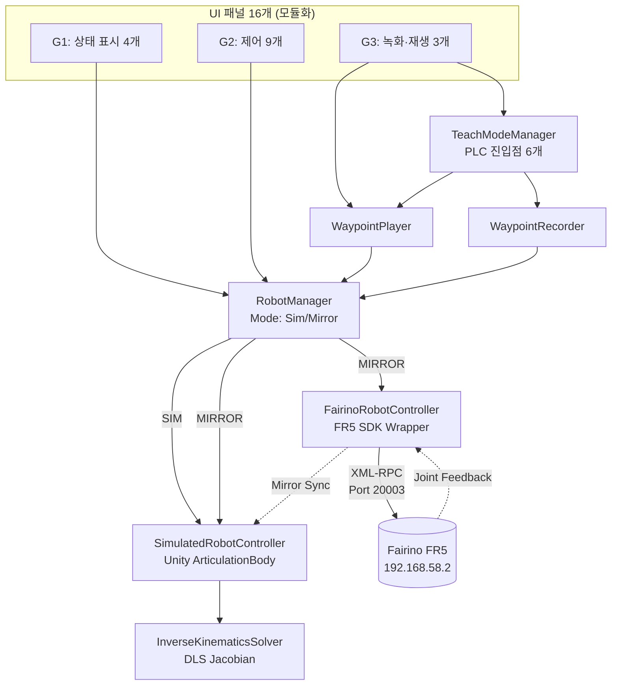

# Fairino FR5 Digital Twin v2

산업용 6축 협동로봇 Fairino FR5와 Unity 시뮬레이터를 실시간 동기화하는 디지털 트윈의 재설계 버전입니다.
UI를 16개 독립 패널로 모듈화하고, 실로봇 PLC 티칭 흐름을 재현하는 웨이포인트 녹화·재생을 추가했습니다.

<!-- 시각 자료 추가 예정: docs/images/demo.gif -->

## v1과의 관계

[v1](https://github.com/kimar1022-code/fairino-fr5-digital-twin)은 단일 `RobotControlUI` 클래스가
모든 UI를 자동 생성하는 모놀리식 구조였습니다. 초기 검증에는 충분했지만, 클래스가 커질수록
수정 한 번에 영향 범위를 가늠하기 어려워져 v2에서 책임별 패널 구조로 재설계했습니다.

| 항목 | 사양 |
|---|---|
| 로봇 모델 | Fairino FR5 (6-DOF 협동로봇) |
| Unity 버전 | 6000.4.3f1 (URP) |
| 언어 | C# (.NET Framework) |
| SDK | Fairino C# SDK (XML-RPC, libfairino.dll) |
| 통신 | Ethernet (192.168.58.2) |
| 개발 기간 | 2026– |

## 기능

모드 시스템 (v1 대비 단순화)
- SIM: 시뮬레이션 단독 (실로봇 없이 테스트)
- MIRROR: 시뮬 + 실로봇 동시 동기화 (Sim이 Real을 매 프레임 추종)
- v1의 REAL 단독 모드는 안전성 우선 정책으로 제거

모듈화된 16개 UI 패널 — v1의 단일 `RobotControlUI`를 책임별 독립 패널로 재구성
- 상태 표시 (G1): StatusPanel, ConnectionPanel, ModePanel, SpeedPanel
- 제어 (G2): HomePanel, StopPanel, GripperPanel, CartesianControlPanel, ControlModePanel, CartesianJogPanel, JointControlPanel + 보조 컴포넌트 2개
- 녹화·재생 (G3): WaypointItem, WaypointPanel, TeachPanel

웨이포인트 녹화 & PLC 시뮬레이션 (신규)
- WaypointRecorder: 현재 자세(조인트 6 + TCP 6 + 그리퍼)를 리스트로 누적 저장
- WaypointPlayer: Play / Pause / Resume / Stop 재생 제어 + 4개 이벤트 발행
- TeachPanel: 실로봇 PLC의 물리버튼 6개(Go Home / Record Start·Stop / Save Waypoint / Play / Stop)를 UI로 재현

그리퍼·홈 포즈
- 0~100% 개폐 + 속도/힘 조절 (Fairino DH 그리퍼)
- 홈 포즈 저장/복귀 (v1의 3개 Pose Slot은 단순화하며 제거)

## 구조


```mermaid
flowchart TD
    subgraph Panels["UI 패널 16개 (모듈화)"]
        G1[G1: 상태 표시 4개]
        G2[G2: 제어 9개]
        G3[G3: 녹화·재생 3개]
    end

    Mgr[RobotManager<br/>Mode: Sim/Mirror]
    Teach[TeachModeManager<br/>PLC 진입점 6개]
    Rec[WaypointRecorder]
    Player[WaypointPlayer]
    Sim[SimulatedRobotController<br/>Unity ArticulationBody]
    Real[FairinoRobotController<br/>FR5 SDK Wrapper]
    IK[InverseKinematicsSolver<br/>DLS Jacobian]
    Robot[(Fairino FR5<br/>192.168.58.2)]

    G1 --> Mgr
    G2 --> Mgr
    G3 --> Teach
    G3 --> Player
    Teach --> Rec
    Teach --> Player
    Player --> Mgr
    Rec --> Mgr

    Mgr -->|SIM| Sim
    Mgr -->|MIRROR| Sim
    Mgr -->|MIRROR| Real
    Sim --> IK
    Real -->|XML-RPC<br/>Port 20003| Robot
    Robot -.->|Joint Feedback| Real
    Real -.->|Mirror Sync| Sim
```

설계 원칙 세 가지를 지켰습니다.

1. Sim은 Real의 그림자 (v1에서 검증된 패턴) — Mirror 모드에서 Sim의 자체 IK를 쓰지 않고 Real의 결과를 매 프레임 재생
2. 단일 책임 패널 — 각 패널은 RobotManager의 책임 영역 하나만 담당, 패널 간 의존성 0
3. 이벤트 기반 갱신 우선 — 가능한 곳은 이벤트 구독, 불가피한 곳만 폴링 (예: WaypointRecorder는 이벤트가 없어 Count 폴링)

## 파일 구성

```
fairino-fr5-digital-twin-v2/
├── Assets/Scripts/RobotControl/
│   ├── Core/          # 코어 11개 클래스 (RobotManager, IK 솔버, Sim/Real 컨트롤러 등)
│   ├── PLC/           # PLCButtonHandler, Waypoint, WaypointRecorder
│   ├── Teach/         # TeachModeManager, WaypointPlayer, WaypointStorage
│   └── UI/Panels/     # 16개 모듈 패널
├── Packages/
└── ProjectSettings/
```

## 실행

Unity 6000.4.3f1 + URDF Importer 패키지, 로봇은 티치펜던트 Auto 모드가 필요합니다.
설치 과정은 [v1의 docs/SETUP.md](https://github.com/kimar1022-code/fairino-fr5-digital-twin/blob/main/docs/SETUP.md)와 같습니다.

네트워크는 로봇 `192.168.58.2` / PC `192.168.58.100` / 서브넷 `255.255.255.0` 기준입니다.

## 트러블슈팅

v1에서 해결한 이슈는 [v1 README](https://github.com/kimar1022-code/fairino-fr5-digital-twin#트러블슈팅) 참고.
핵심 교훈(Sim IK를 끄고 Real을 따라가게 한 Mirror 패턴)은 v2에 그대로 계승했습니다.

## 진행 상태

- [x] 코어 시스템 + URDF 임포트 + Sim/Real 인터페이스 (v1 계승)
- [x] 16개 UI 패널 + TeachModeManager (컴파일 에러·경고 0)
- [ ] 씬 구성 — GameObject 배치 + Inspector 연결
- [ ] 실로봇 연결 테스트 + Mirror 모드 검증
- [ ] WaypointStorage 영구 저장(JSON)
- [ ] 시연 영상

## 참고 자료

- [Unity URDF Importer](https://github.com/Unity-Technologies/URDF-Importer)
- [Fairino Official](https://www.fairino.com)
- Buss & Kim, "Selectively Damped Least Squares for Inverse Kinematics" (2005)
- [v1 저장소](https://github.com/kimar1022-code/fairino-fr5-digital-twin)

## 라이선스

코드는 v1과 같이 MIT 라이선스를 따릅니다.
Fairino SDK는 Fairino 라이선스, URDF Importer는 Unity Asset Store 약관을 따릅니다.
